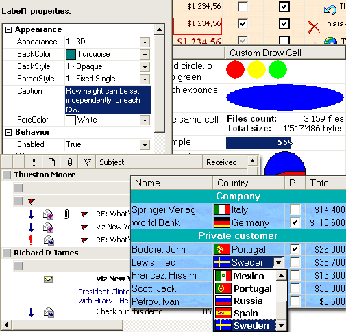



## iGrid Control 2\.1

### Description

Advanced VB grid that can emulate the Outlook messages list, edit its cells using built-in editors (textbox,combo,checkbox), supports virtual mode and allows sophisticated displays to be set up. Demos and support files can be found at http://www.10Tec.com/
 
### More Info
 

             |
---                |---
**Submitted On**   |
**By**             |[10Tec Company](https://github.com/Planet-Source-Code/PSCIndex/blob/master/ByAuthor/10tec-company.md)
**Level**          |Intermediate
**User Rating**    |3.1 (22 globes from 7 users)
**Compatibility**  |VB 4\.0 \(32\-bit\), VB 5\.0, VB 6\.0, VBA MS Access, VBA MS Excel
**Category**       |[OLE/ COM/ DCOM/ Active\-X](https://github.com/Planet-Source-Code/PSCIndex/blob/master/ByCategory/ole-com-dcom-active-x__1-29.md)
**World**          |[Visual Basic](https://github.com/Planet-Source-Code/PSCIndex/blob/master/ByWorld/visual-basic.md)
**Archive File**   |

### Source Code

 

<b>Please, read this carefully:</b>

First of all, we must to say that we made a mistake when we published this review. The fact is that we saw the "Third Party Product Review" option without any explanation after we had pressed the Upload button and, of course, we as a third-party developer of components, published this review. We didn't know at that time that only PSC visitors can publish their review about components they use. But we've decided to keep this review because all of its comments are practically the same that PSC implies ("Reviews are a new feature of Planet Source Code that allow site visitors to share their experiences on commercial third party products in real life situations").

Secondly, the first version of this control was really based on the source code of vbAccelerator S-Grid control (which is free). But today iGrid is an independent and powerfull editable grid control. We have been working at iGrid last two years. We've fixed at least 100 bugs in S-Grid, we've implemented a lot of new features and we support our control today and will support it in the future! You must decide by youself what is more suitable for you - free non-editable non-supported S-Grid or our commercial iGrid with numerous new useful features and instant support.

<b>iGrid features</b>

iGrid ActiveX control is a grid control that allows you to edit its cells using built-in editors and can emulate the Outlook messages list. The highly optimized flicker-free display code makes this grid draw faster than FlexGrid and other VB grids even while it allows more sophisticated displays to be set up. It is also a good replacement for a ListView in report mode.

iGrid implements many useful features - multicolumn sorting, custom draw cells, saving and restoring its layout, own Memory Manager.
Each cell of the grid can be formatted separately from other cells in the grid and even from the cells of the same column. Developers can use format strings, format flags (horizontal and vertical alignment, ellipsis at the end or at the middle of the cell text, if necessary, so that the result fits in the cell rectangle, prefix characters ("&") in the cell text, etc). Colors of iGrid elements can be adjusted. You can also turn off vertical and/or vertical or horizontal grid lines, use multiselect mode to select some cells simultaneously and row mode to select all cells in a single row, headers of columns may be flat or 3D and can be dragged or not, and so on.

The main distinctive feature of iGrid from is the ability to edit its cells using built-in in-place editing features (textboxes, comboboxes and checkboxes using a lot of formatting options for each type of cells - single-line and multi-line textboxes, automatic adjustment dropdown width of comboboxes based on the longest text width of comboitems, checkboxes with two and three states , etc). It also provides a lot of useful methods and events for fine tuning of editing process. These methods and events allow to control the flow of editing process and validate data entered by the user. Events for control of editing process include RequestEdit, BeforeCommitEdit, AfterCommitEdit and CancelEdit.
iGrid supports virtual mode. In this mode, iGrid will request new rows whenever they need to be displayed.

iGrid is meant to be an extensible control you can use to create your own fully customizable interfaces. iGrid Extra Demos pack demonstrates how you can implement:
<UL>
<LI>treeview functionality with dynamic loading of child items (when the user clicks the plus button at the first time);
<LI>cells with the ellipsis button and non-standard buttons (for instance, colored multiline caption);
<LI>standard and balloon tooltips for iGrid cells and column headers;
<LI>drag-n-drop operation when the user can select several rows in multiselect mode and drag them into another grid.
</UL>

